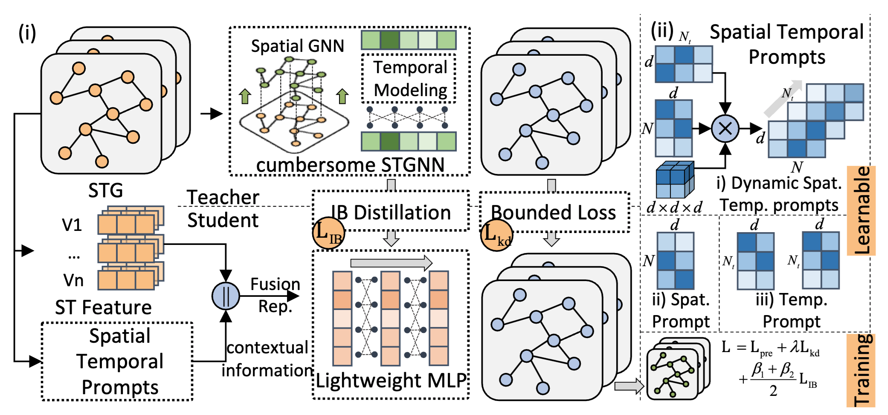

# EasyST: A Simple Framework for Spatio-Temporal Prediction

This is the PyTorch implementation by <a href='https://github.com/tjb-tech'>@Jiabin Tang</a> for STExplainer model proposed in this paper:

 >**<a href='https://arxiv.org/abs/2409.06748'>EasyST: A Simple Framework for Spatio-Temporal Prediction</a>**  
 >Jiabin Tang, Wei Wei, Lianghao Xia, Chao Huang*\
 >*CIKM 2024*

\* denotes corresponding author

<p align="center">

</p>

In this paper, we propose a simple framework for spatio-temporal prediction - **EasyST** paradigm. It learns lightweight and robust Multi-Layer Perceptrons (MLPs) by effectively distilling knowledge from complex spatio-temporal GNNs. We ensure robust knowledge distillation by integrating the spatio-temporal information bottleneck with teacher-bounded regression loss, filtering out task-irrelevant noise and avoiding erroneous guidance. We further enhance the generalization ability of the student model by incorporating spatial and temporal prompts to provide downstream task contexts.  

## Environment

Please first clone the repo and install the required environment, which can be done by running the following commands:

```shell
conda env create -n easyst python=3.8

conda activate easyst

# Torch with CUDA 11.6
pip install torch==1.12.0+cu116 torchvision==0.13.0+cu116 torchaudio==0.12.0 --extra-index-url https://download.pytorch.org/whl/cu116
# Clone our STExplainer
git clone https://github.com/HKUDS/EasyST.git
cd EasyST
# Install required libraries
pip install -r requirements.txt
```

##  Dataset

We have open-sourced the data used in the paper on Hugging Face🤗 repository [Large Spatio-Temporal Graph (LSTG)](https://huggingface.co/datasets/Jiabin99/LSTG_data).

| Dataset          | Hugging Face🤗 Url                                            |
| ---------------- | ------------------------------------------------------------ |
| **Traffic data** | https://huggingface.co/datasets/Jiabin99/LSTG_data/tree/main/dataset/PEMS07 |
| **Crime Data**   | https://huggingface.co/datasets/Jiabin99/LSTG_data/tree/main/dataset/CHI_Crime |
| **Weather Data** | https://huggingface.co/datasets/Jiabin99/LSTG_data/tree/main/dataset/weather2k |

Download the data and place it in the `data` directory, and you can directly use this framework.

## Examples to run the codes

We could modify configuration at [./config](./config) to train or test teacher and student model on different datasets. There is an example of training teacher models on three datasets [./run_teacher.sh](./run_teacher.sh): 

```bash
python train_teacher.py --config ./kdstg/config/teacher/stgcn/pems07/teacher_stgcn_end_dim_128_pems7.yaml # Traffic data
python train_teacher.py --config ./kdstg/config/teacher/stgcn/chi_crime/teacher_stgcn_end_dim_128_chi.yaml # Crime Data
python train_teacher.py --config ./kdstg/config/teacher/stgcn/pems07/teacher_stgcn_end_dim_128_wth.yaml # Weather Data

```

And an example of training a student model on Traffic data [./run_student.sh](./run_student.sh): 

```bash
python train_student.py --config ./config/student/dmlp_ib/pems07/stgcn/student.yaml
```

## Reference

If you find this work is helpful to your research, please consider citing our paper:

```tex
@misc{tang2024easyst,
    title={EasyST: A Simple Framework for Spatio-Temporal Prediction},
    author={Jiabin Tang and Wei Wei and Lianghao Xia and Chao Huang},
    year={2024},
    eprint={2409.06748},
    archivePrefix={arXiv},
    primaryClass={cs.LG}
}
```


## Acknowledgements

The structure of our code is based on [BasicTS](https://github.com/zezhishao/BasicTS) and [GIB](https://github.com/snap-stanford/GIB). Thank for their work.